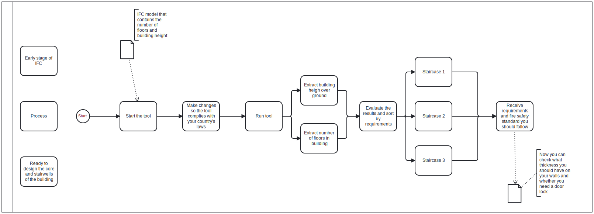

# About the tool 
#### Group 9 
#### Noah Whiddon Carlsson - s243671 
#### Guðný Birna Sigurðardóttir - s242686 

## Purpose of the Tool
The primary claim being addressed by the tool is determining whether Building 11 requires a pressurized staircase and/or a firefighter lift according to Icelandic building regulations and guidelines. 
Additionally, the tool specifies what features the building must have according to. If for example what safety standard it should follow for fire compartments, structural elements or more also if there is a requirement for a door lock (sluss) on the different floors. 

## Identifying the Issue
This issue arises during the early planning stages of building design, a critical phase where fire safety engineers must determine appropriate fire safety measures based on the building's height, number of floors, and intended use. 
By using this tool, engineers can directly access to the requirements guidelines for the specific height and number of floors the building has. Which lowers the chance of making a mistake in the planning of the stairwells and makes the job as a fire engineer more efficient. 

## How the Tool Works
The tool determines the building height (from the ground floor to the roof) and the number of floors. Based on this information, it evaluates the applicable fire safety requirements, including whether pressurized staircases or a firefighter lift are needed.

## Step-by-Step Instructions

step 1: Get your hands on the IFC model file and add it to your model folder

step 2: Rename the IFC model file to a memorable and recognizable name.

step 3:  Open the tool and add the path to your IFC model where it says [model = ifcopenshell.open(“your path hear”) ]

Modify lines 64, 65, 67, 68, and 71 of the script to align with your country's building regulations and fire safety guidelines, considering the building's height and number of floors above ground.

step 5: When you are set to run the tool press on the button run python file and sit back and enjoy, the tool can take some time it really depends on the size of the IFC file. 

step 6: After the tool finishes running, it will display it will display the building’s total height and number of floors above ground, along with the relevant requirements and guidelines based on your country’s regulations. 

## What Advanced Building Design Stage (A, B, C or D) would your tool be useful?
The tool is most useful in stages A or B, the early stages of building modeling, where the model has the amount of floors and the height of the building. The fire exits are normally in the core of the building and the core is one of the first modeled parts of a building. And to be able to model it you have to know the wall thickness and how the floor plan should look around the core regarding the requirements seas about the if we need a door sluss. 

## Intended Users of the Tool
The tool would primarily benefit fire safety engineers and architects.

## Model Requirements for the Tool
The IFC model must define the ground floor with one of the following names: "Ground Floor," "Level 0," or "Ground." After the tool can define what floor is the ground floor it can begin counting the number of floors above ground as well as the height of the building from the ground floor.

