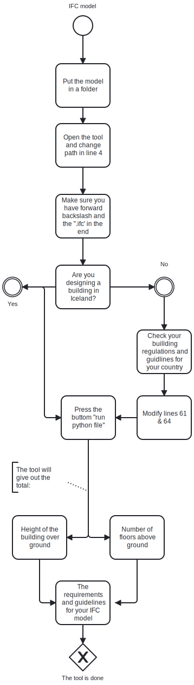

## Using the tool

### Video tutorials

- [Video Tutorial #1]((https://youtu.be/K9nn7htir8w))

## Explanation of python code
The code analyzes an IFC model to determine key fire safety requirements based on the building's height and number of floors. It performs the following steps:

1. Extracts Building Data: Reads the building model to identify all floors (storeys) and their elevations.
2. Identifies Ground and Topmost Floors: Uses naming conventions or elevation values to pinpoint the ground floor and the topmost floor.
3. Calculates Building Height: Computes the height of the building by subtracting the ground floor's elevation from the topmost floor's elevation.
4. Counts Floors Above Ground: Counts the number of floors situated above the identified ground floor.
5. Applies Fire Safety Rules: Based on the building's height and number of floors:
- Determines the required fire resistance of staircases.
- Specifies additional fire safety features like fire compartments, pressurized slusses, or firefighter lifts.
  The code outputs the calculated building height, floor count, and the corresponding safety requirements for the staircases. This makes it a valuable tool for ensuring compliance with fire safety regulations during the early design stages.
